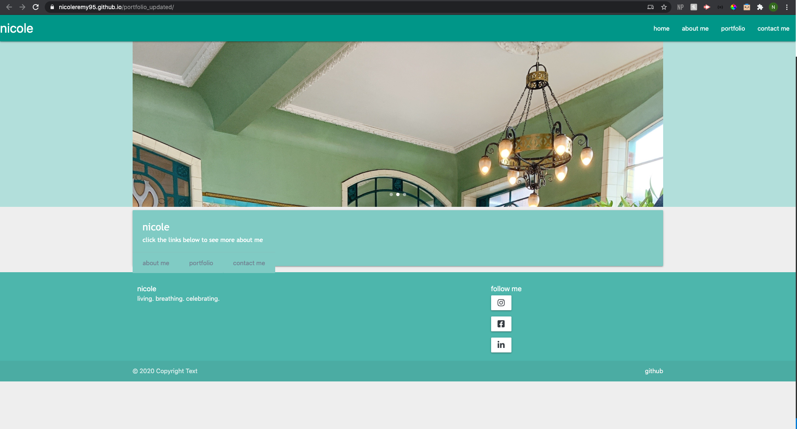
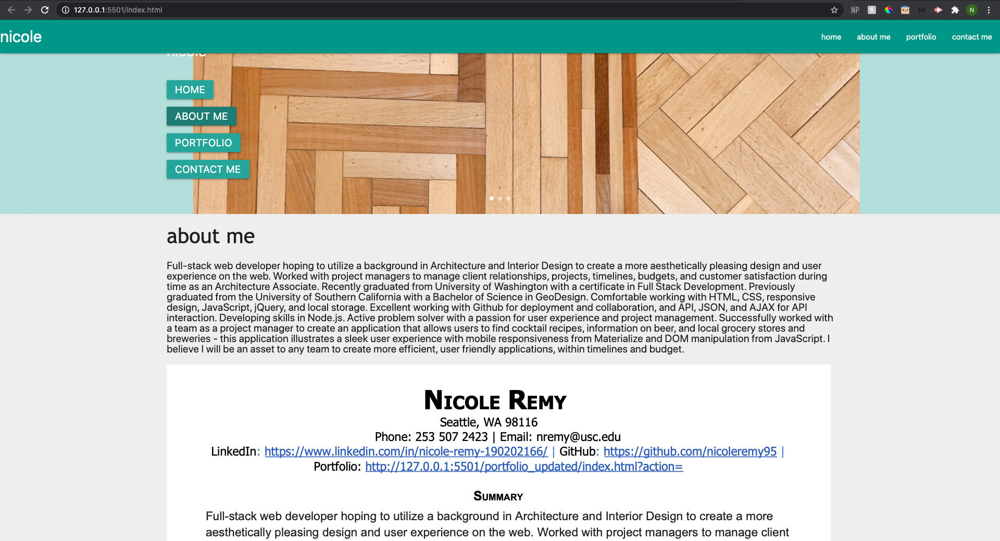
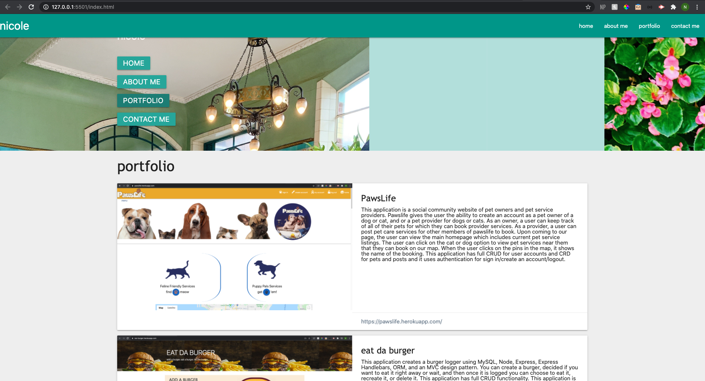

# portfolio_updated
hw 7 updated portfolio 
 
 #### nicole 
This website tells you all about me and my portfolio work. My portfolio website uses Materialize, Javascript, CSS, HTML, and jQuery.

#### index.html
The head of the index file includes links to a favicon, reset css, materialize, style css, and a font awesome link. It also includes script files for jQuery, materialize, the carousel images, and the logic for javascript. The index file includes a nav bar header with links that run functions in my javascript file. The carousel image runs with the display.js file. The content body of the page is controlled with the script file. The footer features font awesome links to my social media and a link at the bottom to my github. The application is mobile responsive due to materialize. 

#### style.css
The style of this page is controlled through the style.css file. 

#### script.js
The script file runs four functions: home, about me, portfolio, and contact me. These functions run once the link in the nav bar is clicked. 

#### comparison to my last portfolio
This portfolio compared to my first in hw2 is much more elevated aesthically and technically. The hw2 used three html documents and no script file whereas in portfolio updated I used only 1 html page and utilized DOM manipulation with javascript and jquery to dynamically create pages. 

## Images of Completed Website 

### Step 1

### Step 2

### Step 3x

## Link to Site

Deployed website [nicole](https://nicoleremy95.github.io/portfolio_updated/)

## Contributing
Pull requests are welcome. For major changes, please open an issue first to discuss what you would like to change.

Please make sure to update tests as appropriate.

## License
[2020](https://choosealicense.com/licenses/mit/)